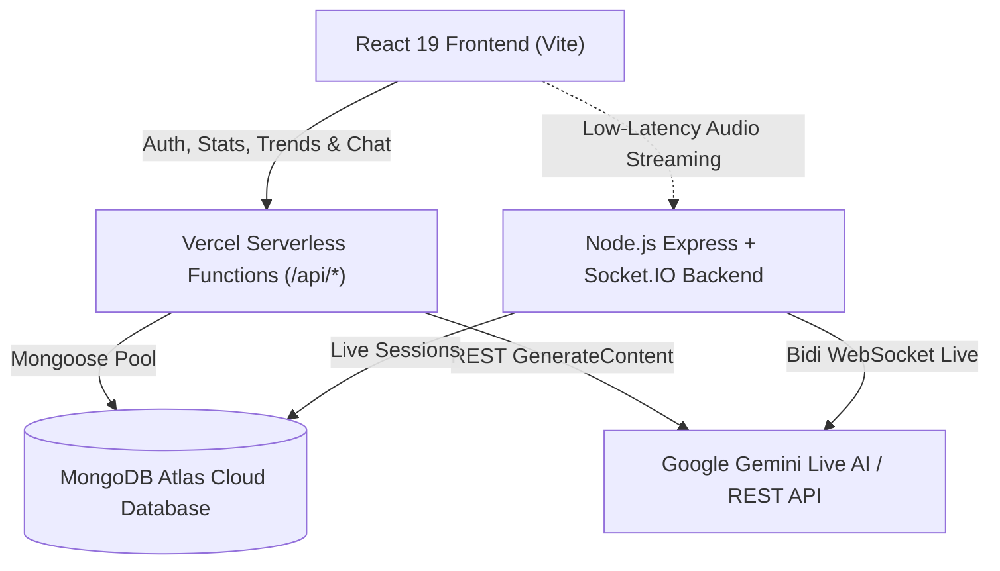

# 🎙️ VoiceAI Studio

<p align="center">
  <strong>Real-Time Multimodal Voice Intelligence Platform & Telemetry Dashboard</strong>
</p>

<p align="center">
  
  
  
  
  
  
</p>

---

## 🌟 Overview

**VoiceAI Studio** is a fullstack web application that combines **real-time AI voice interaction**, **intelligent chat conversation**, **JWT-based user authentication**, and a **live telemetry dashboard** powered by **MongoDB Atlas** and **Google Gemini AI**.

Users can hold continuous hands-free voice conversations with customizable AI personas, track real-time session tokens and estimated API costs, view trend charts, and securely access their workspace with authentication.

---

## ✨ Key Features

### 🗣️ 1. Continuous Hands-Free Voice Agent
- **One-Click Voice Dialogue:** Tap "Start Voice Session" to initiate an ongoing back-and-forth conversation.
- **Hands-Free Conversational Loop:** Speak ➔ AI responds and speaks aloud ➔ Microphone automatically resumes listening for the next turn.
- **Echo Prevention:** Mutes the mic automatically while the AI speaks so it never interrupts or echoes itself.
- **Dual Engine Architecture:**
  - **Serverless Web Speech (Vercel):** Seamless speech-to-text recognition with instant conversational AI fallback and speech synthesis.
  - **Gemini Live WebSockets (Node.js):** Direct bidirectional 16kHz PCM input and 24kHz audio playback over WebSockets.
- **Custom Personas:** Switch on the fly between *Helpful Assistant*, *Data Analyst*, *Customer Support*, and *Technical Expert*.

### 📊 2. Live Telemetry & Analytics Dashboard
- **Real-Time Metrics:** Live stats for Active Sessions, Completed Sessions, Total Tokens Consumed, and Estimated Cost ($).
- **Interactive Visualizations:**
  - **7-Day Cost Trends:** Area chart showing daily expenditure with custom glassmorphism tooltips.
  - **Session Activity:** Bar chart displaying daily conversational session volume.
- **Recent Sessions Table:** Status badges, duration timers, token counters, and cost calculations synced to MongoDB Atlas.

### 🔐 3. User Authentication & MongoDB Atlas
- **Secure Access Control:** The dashboard is protected; only authenticated users can view telemetry and agents.
- **JWT & bcrypt Encryption:** Salting and hashing passwords before saving to MongoDB Atlas; tokens stored securely in `localStorage`.
- **Auto-Logout & Session Verification:** Automatic `/api/auth/me` token check and session refresh.
- **Profile Navigation:** User avatar initials, name, email badge, and 1-click logout in the glass navbar.

### 🎨 4. Premium Glassmorphic Design System
- Modern dark luxury theme with sleek frosted glass cards (`backdrop-blur-xl`).
- Dynamic status rings, pulsing glowing mics, and animated loading indicators.
- Inter typography with custom CSS tokens (`--surface`, `--gradient-primary`, etc.).

---

## 🏗️ System Architecture



---

## 🛠️ Tech Stack

| Layer | Technologies |
| :--- | :--- |
| **Frontend** | React 19, Vite 8, TailwindCSS 4, Lucide React, Recharts, Axios, Socket.IO Client |
| **Backend** | Node.js, Express, Socket.IO, ws (WebSockets), JSON Web Tokens (`jsonwebtoken`), `bcryptjs`, `dotenv` |
| **Database** | MongoDB Atlas, Mongoose ORM (with serverless connection caching) |
| **AI & Voice** | Google Gemini Live (`gemini-3.1-flash-live-preview`), Gemini 2.5 Flash, Web Speech Recognition & Synthesis |
| **Deployment** | Vercel (Frontend & Serverless Functions), Railway / Render (Optional persistent Node server) |

---

## 📂 Project Structure

```
voice/
├── api/                           # Vercel Serverless Fullstack Handlers
│   ├── index.js                   # Unified Express Serverless API handler
│   └── models/                    # Serverless Mongoose Schemas (User, Session)
│       ├── Session.js
│       └── User.js
├── backend/                       # Dedicated Persistent Node.js Server
│   ├── models/                    # Backend Schemas (User, Session)
│   ├── server.js                  # Express, Socket.IO, Gemini Live WebSockets
│   ├── package.json
│   └── .env                       # Local backend environment secrets
├── frontend/                      # React SPA (Vite)
│   ├── src/
│   │   ├── components/
│   │   │   ├── Dashboard.jsx      # Telemetry analytics & Recharts visualizations
│   │   │   ├── Login.jsx          # Glassmorphic auth (Sign In / Register)
│   │   │   └── VoiceAgent.jsx     # Continuous voice session & text chat
│   │   ├── App.jsx                # Auth routing, navbar, profile badge
│   │   ├── config.js              # Dynamic API & WebSocket configuration
│   │   ├── index.css              # Custom design system tokens & glass styling
│   │   └── main.jsx               # Axios JWT interceptors
│   ├── package.json
│   ├── vercel.json                # Frontend SPA rewrites
│   └── vite.config.js
├── vercel.json                    # Fullstack Vercel deployment routing
├── package.json                   # Root package definition
└── .gitignore                     # Git protection (secrets & node_modules)
```

---

## 🚀 Getting Started (Local Setup)

### Prerequisites
- [Node.js](https://nodejs.org/) (v18 or higher)
- [MongoDB Atlas Account](https://www.mongodb.com/cloud/atlas)
- [Google AI Studio Gemini API Key](https://aistudio.google.com/app/apikey)

### 1. Clone the Repository
```bash
git clone https://github.com/anishstatic/voice.git
cd voice
```

### 2. Configure Environment Variables
Create a `.env` file in the root and in `backend/`:

```env
PORT=5001
MONGODB_URI=your_mongodb_atlas_connection_string
JWT_SECRET=your_super_secret_jwt_key
GEMINI_API_KEY=your_gemini_api_key
GEMINI_LIVE_MODEL=gemini-3.1-flash-live-preview
```

### 3. Install Dependencies
```bash
# Install root & backend dependencies
npm install
cd backend && npm install

# Install frontend dependencies
cd ../frontend && npm install
```

### 4. Run the Application
Open two separate terminals in your code editor:

**Terminal 1 (Backend):**
```bash
cd backend
node server.js
```
*(Runs on `http://localhost:5001` with active MongoDB connection)*

**Terminal 2 (Frontend):**
```bash
cd frontend
npm run dev
```
*(Runs on `http://localhost:5173`)*

Open your browser at `http://localhost:5173` to view the app!

---

## ☁️ Deployment Guide

### Deploying 100% on Vercel (Fullstack Serverless)

1. Push your repository to **GitHub**.
2. Log in to [Vercel](https://vercel.com/) and click **"Add New..."** ➔ **"Project"**.
3. Import your repository (`voice`).
4. In **Settings ➔ Environment Variables**, add:
   - `MONGODB_URI`: Your MongoDB Atlas cluster connection string.
   - `JWT_SECRET`: A secret key for signing user session tokens.
   - `GEMINI_API_KEY`: Your Google Gemini API key.
5. In **MongoDB Atlas ➔ Network Access**, verify that `0.0.0.0/0` (Allow access from anywhere) is **Active** so Vercel can reach your cluster.
6. Click **Deploy**. Your app will be live 24/7 on `https://your-project.vercel.app`!

---

## 📡 API Reference

### Authentication
| Method | Endpoint | Description | Auth Required |
| :--- | :--- | :--- | :--- |
| `POST` | `/api/auth/register` | Register a new user (`name`, `email`, `password`) | No |
| `POST` | `/api/auth/login` | Login user and receive signed JWT token | No |
| `GET` | `/api/auth/me` | Fetch authenticated user data with Bearer token | Yes |

### Telemetry & Dashboard
| Method | Endpoint | Description | Auth Required |
| :--- | :--- | :--- | :--- |
| `GET` | `/api/stats` | Total sessions, token counts, cost calculations | Yes |
| `GET` | `/api/trends` | 7-day historical session & cost trends for charts | Yes |

### Conversational AI
| Method | Endpoint | Description | Auth Required |
| :--- | :--- | :--- | :--- |
| `POST` | `/api/chat` | Send prompt to Gemini AI with persona & speech reply | No |

---

## 🛡️ Security Best Practices
- Passwords hashed using `bcryptjs` with auto-generated salt rounds.
- Tokens signed with `jsonwebtoken` (7-day validity) and attached via Axios request interceptors.
- Root `.gitignore` prevents `.env` secrets or keys from ever being committed to Git.
- Mongoose queries configured with `bufferCommands: false` to eliminate hanging serverless queries.

---

## 📄 License
This project is licensed under the MIT License.
